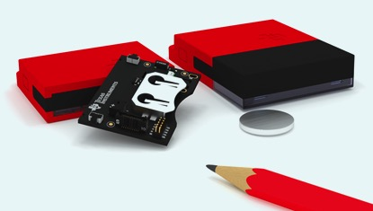
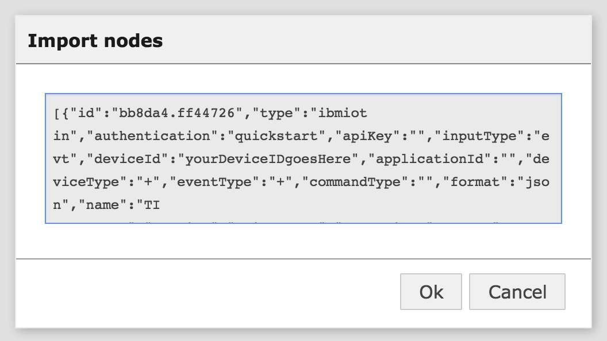
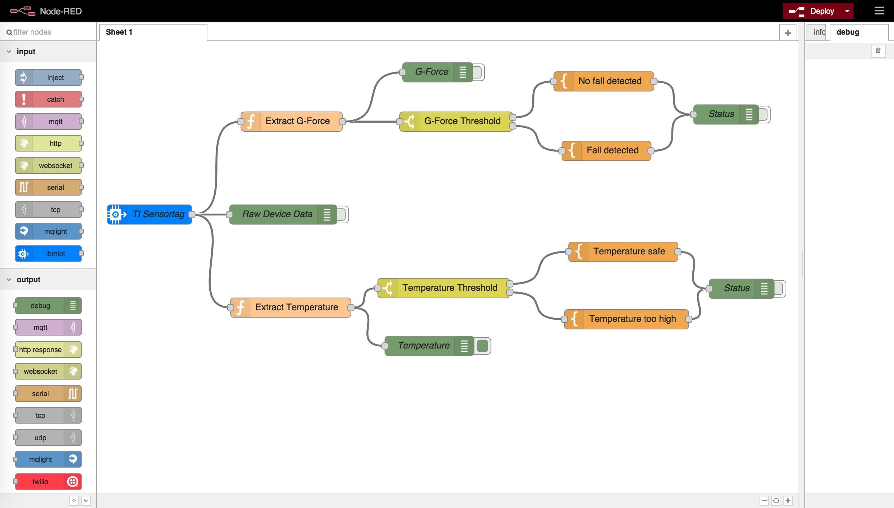

# Overview

This is a demo showing how to connect a [Texas Instrument SimpleLink SensorTag] (http://www.ti.com/ww/en/wireless_connectivity/sensortag2015/?INTC=SensorTag&HQS=sensortag) via the [Internet of Things Foundation Service] (https://internetofthings.ibmcloud.com/#/) to a [Node-RED](http://nodered.org/) flow running on [IBM Bluemix](http://www.bluemix.net).


## Prerequisites



You will need a TI SimpleLink SensorTag, which can be bought in various online shops for about $25 or [directly from TI](https://store.ti.com/AddToCart_TI.aspx?p=CC2650STK).

Next, use [this tutorial](https://developer.ibm.com/recipes/tutorials/connect-a-cc2650-sensortag-to-the-iot-foundations-quickstart) to get your SensorTag ready to send data to the IBM IoT cloud, so that we can use it in a Bluemix application.

**Note :** If your SensorTag has an older firmware version, you might need to update it in order for the sensors to stream data correctly. This can be done via the smartphone app. Version 1.12 (or later) seems to work fine.

Make sure that you slide the "Sourcing" slider in the smartphone app to the "on" position. You can view the ID of your SensorTag bei either opening the link at the top of the "Cloud View" or using the "share" icon to send it in a mail to yourself. The device ID should an alphanumeric string of 12 characters. You will need it later, specifically in step 13 below.

If you **do not have a SensorTag**, you can use any modern smartphone as a "fake" sensor. Just navigate from your phones browser [to this page here](https://quickstart.internetofthings.ibmcloud.com/iotsensor/). The page you just opened will "pretend" to be a temperature and humidity sensor. Here is a [link to a short tutorial] (https://developer.ibm.com/recipes/tutorials/use-the-simulated-device-to-experience-the-iot-foundation/) that will give you more background. The ID of your fake sensor will be displayed on the upper right of the page you opened on your smartphone. It's an alphanumeric string of 12 characters, which you will need later, specifically in step 13 below.

## Steps to deploy Node-RED on Bluemix

**Step 1:** If you don't already have a Bluemix account, go to [http://www.bluemix.net] (http://www.bluemix.net) and sign up (it's free).

**Step 2:** Log into your bluemix account.

**Step 3:** Navigate to the Bluemix catalog.

**Step 4:** Click on the "Internet of Things Foundation Starter" tile. It's in the "Boilerplate" section towards the top of the catalog.

**Step 5:** Enter a unique name for your application into the "Name:" field on the right hand side.

**Step 6:** Click "create" to deploy the application on Bluemix.

**Step 7:** After a minute or two, you should see a notice that your application is now running. Click on the blue link at the top, it should be named something like: http://TheNameThatYouChoseInStep5.mybluemix.net .

**Step 8:** The above should lead you to a page with the title "Node-RED in Bluemix for IBM Internet of Things Foundation". It has a big red button "Go to your Node-RED flow editor" in the lower right. Click on it.

**Step 9:** You are now be in your Node-RED flow editor. It is already populated with a few nodes. Mark them all with Ctrl-a and then delete them (using the backspace key). We will start with a clean canvas.

## Steps to import the Node-RED flow

**Step 10:** Here is the flow that will connect your TI Sensor Tag with the IoT Foundation service. Select all of the JSON below and copy it into your clipboard.

```
[{"id":"bb8da4.ff44726","type":"ibmiot in","authentication":"quickstart","apiKey":"","inputType":"evt","deviceId":"yourDeviceIDgoesHere","applicationId":"","deviceType":"+","eventType":"+","commandType":"","format":"json","name":"TI Sensortag","service":"quickstart","allDevices":false,"allApplications":false,"allDeviceTypes":true,"allEvents":true,"allCommands":false,"allFormats":false,"x":81,"y":266.9999966621399,"z":"835b45a1.7ca4b8","wires":[["8379964f.7c8668","7943faac.86bc04","c5ba0a32.3a45f8"]]},{"id":"8379964f.7c8668","type":"function","name":"Extract G-Force","func":"return {payload:msg.payload.d.gyroY};","outputs":1,"noerr":0,"x":299.5000286102295,"y":124,"z":"835b45a1.7ca4b8","wires":[["9431664d.6bce98","db50b388.24af5"]]},{"id":"9431664d.6bce98","type":"switch","name":"G-Force Threshold","property":"payload","rules":[{"t":"btwn","v":"-30","v2":"30"},{"t":"else"}],"checkall":"true","outputs":2,"x":552.5000286102295,"y":124,"z":"835b45a1.7ca4b8","wires":[["7bfbe7a0.840418"],["9368e07.f6c972"]]},{"id":"37399a5f.c8c666","type":"debug","name":"Status","active":false,"complete":"payload","x":967.5000286102295,"y":113,"z":"835b45a1.7ca4b8","wires":[]},{"id":"7943faac.86bc04","type":"debug","name":"Raw Device Data","active":false,"console":"false","complete":"true","x":286.5,"y":266.9999966621399,"z":"835b45a1.7ca4b8","wires":[]},{"id":"7bfbe7a0.840418","type":"template","name":"No fall detected","field":"","template":"G-Force ({{payload}}) within safe limits","x":779.5000286102295,"y":62,"z":"835b45a1.7ca4b8","wires":[["37399a5f.c8c666"]]},{"id":"9368e07.f6c972","type":"template","name":"Fall detected","field":"","template":"G-Force ({{payload}}) critical","x":783.5000286102295,"y":169,"z":"835b45a1.7ca4b8","wires":[["37399a5f.c8c666"]]},{"id":"db50b388.24af5","type":"debug","name":"G-Force","active":false,"console":"false","complete":"payload","x":523.9999980926514,"y":48,"z":"835b45a1.7ca4b8","wires":[]},{"id":"c5ba0a32.3a45f8","type":"function","name":"Extract Temperature","func":"return {payload:msg.payload.d.IRTemp};","outputs":1,"noerr":0,"x":298.0952434539795,"y":410.337890625,"z":"835b45a1.7ca4b8","wires":[["1f6b51d8.e094ae","57595a77.a8a6a4"]]},{"id":"f7156858.08ea98","type":"debug","name":"Status","active":false,"console":"false","complete":"payload","x":991.3809623718262,"y":381.33790922164917,"z":"835b45a1.7ca4b8","wires":[]},{"id":"1f6b51d8.e094ae","type":"switch","name":"Temperature Threshold","property":"payload","rules":[{"t":"lt","v":"27"},{"t":"else"}],"checkall":"true","outputs":2,"x":533.3809623718262,"y":380.33790922164917,"z":"835b45a1.7ca4b8","wires":[["4f7dc9bf.b08238"],["5f44c74.fa0bb38"]]},{"id":"5f44c74.fa0bb38","type":"template","name":"Temperature too high","field":"","template":"Temperature ({{payload}}) is too high!","x":814.3809623718262,"y":428.33790922164917,"z":"835b45a1.7ca4b8","wires":[["f7156858.08ea98"]]},{"id":"4f7dc9bf.b08238","type":"template","name":"Temperature safe","field":"","template":"Temperature ({{payload}}) within safe limits","x":809.3809623718262,"y":324.33790922164917,"z":"835b45a1.7ca4b8","wires":[["f7156858.08ea98"]]},{"id":"57595a77.a8a6a4","type":"debug","name":"Temperature","active":true,"console":"false","complete":"payload","x":511.3809623718262,"y":469.33790159225464,"z":"835b45a1.7ca4b8","wires":[]}]
```

**Step 11:** Next import the flow into the Node-RED instance on Bluemix.

- Click on the menu on the upper right of the Node-RED user interface

- Navigate to "Import" and then "Clipboard"


- Paste the content of your clipboard (which should contain the flow that you copied in step 10 above) into the window and click on "Ok"



**Step 12:** You should now see the imported flow in your Node-RED editor.



**Step 13:** Once you have imported the flow you will need to double click on the IBM IoT node (labelled "TI Sensortag" in the screenshot above) to open the configuration properties and replace the device ID with the device ID of your specific SensorTag (see the Prerequisites section above). Click "Ok" to finish the configuration of the node.

**Step 14:** Click on the red "Deploy" button (upper right) to deploy your flow to Bluemix. You will need to do this each time you change the flow.

**Step 15:** Activate any of the green debug nodes to see data (e.g. temperature or acceleration) flowing from your SensorTag. You will need to click on the "debug" tab on the upper right to see it.

**Done**

You can now play with the various debug nodes on your canvas. How about changing the threshold values in the yellow nodes? Or maybe adding new nodes to your flow by dragging them in from the palette on the left? Nodes are connected through simple clicking and dragging.

Don't forget to hit the "Deploy" button after every change you make in the flow!

Start playing and have fun!

There are many Node-RED flows with interesting and creative ideas out there ([Google is your friend](https://www.google.com/search?q=NODE-RED%20bluemix)). Github has some interesting repos as well, how about [using your SensorTag in an alarm system](https://github.com/chrrel/bluemix-alarm-system)? Last but not least, the Node-RED website has a [collection of user-provided flows and nodes](http://flows.nodered.org/) as well.

## Contribute
We are more than happy to accept external contributions to this project, be it in the form of issues and pull requests. If you find a bug, please report it via the [Issues section][issues_url] or even better, fork the project and submit a pull request with your fix! Pull requests will be evaulated on an individual basis based on value add to the sample application.


## Things don't work? Here is where to get help

Maybe your internet connection does not allow websocket traffic (which I've seen when connected within some firewalls or when using hotel Wifi). To check whether websockets work for you, head over [here](http://websocketstest.com/).

Before asking questions, make sure to consult the documentation. Here is the [link to the general Buemix docs] (https://www.ng.bluemix.net/docs), you'll find the [docs for the IoT Foundation service here] (https://docs.internetofthings.ibmcloud.com).

If you have technical questions about Bluemix or the IoT Foundation service, head on over to [Stackoverflow] (http://stackoverflow.com/questions/tagged/bluemix) and make sure to tag your question with "Bluemix".

Another good resource is dW Answers, specifically the "Internet of Things" section [here](https://developer.ibm.com/answers/smartspace/internet-of-things).

The [SimpleLink Support Forum] (http://e2e.ti.com/support/wireless_connectivity/f/538) is a great place to get questions answered that pertain directly to the SensorTag itself.

# License

See [LICENSE](LICENSE) file.

[issues_url]: https://github.com/uwefassnacht/ti-sensor-tag-demo/issues
